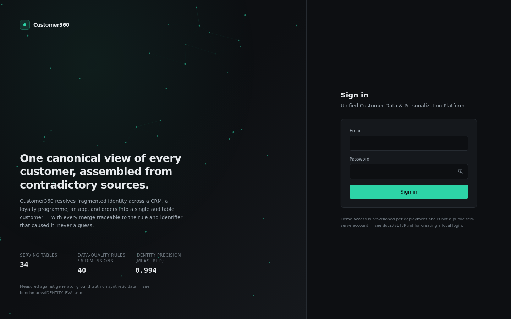
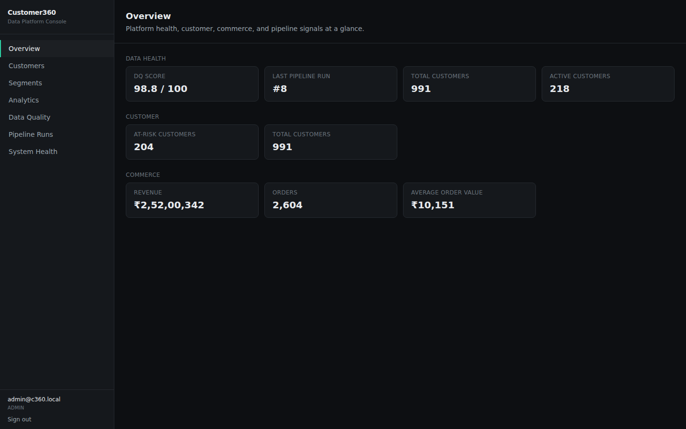
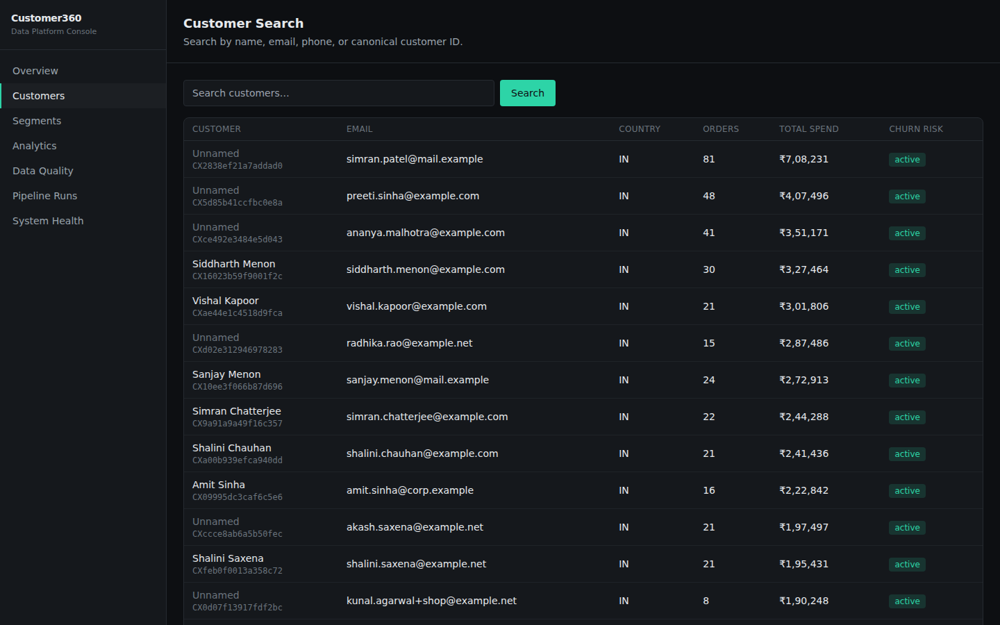
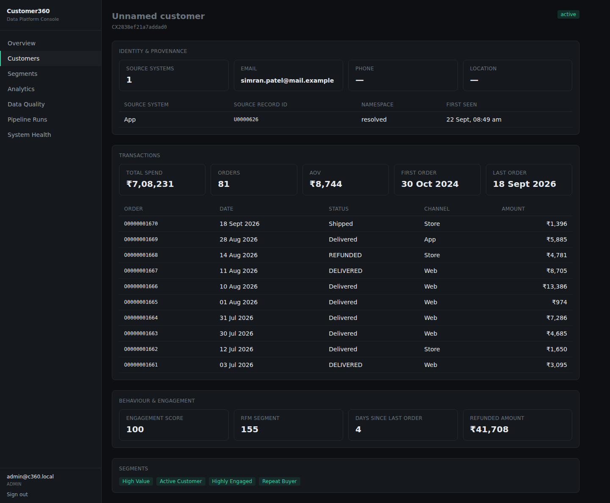
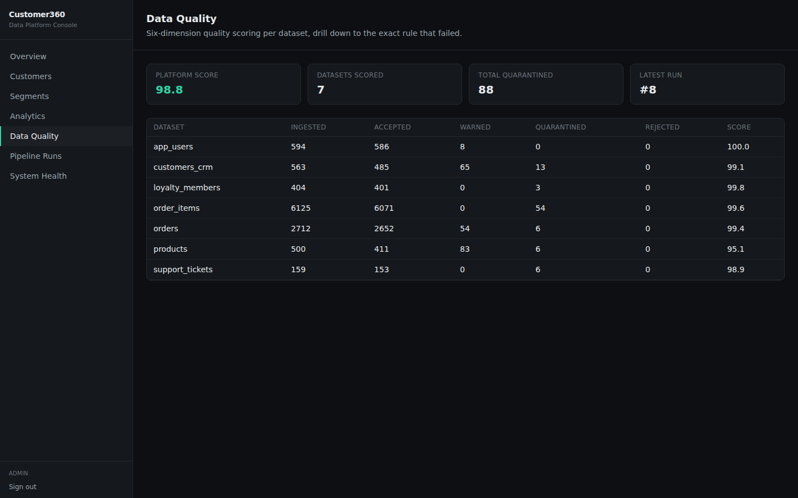
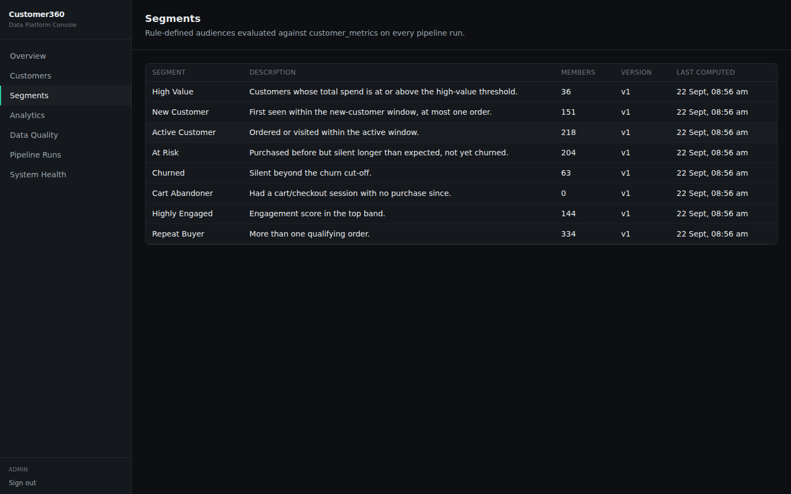
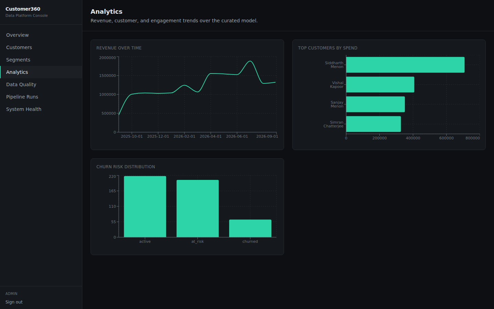
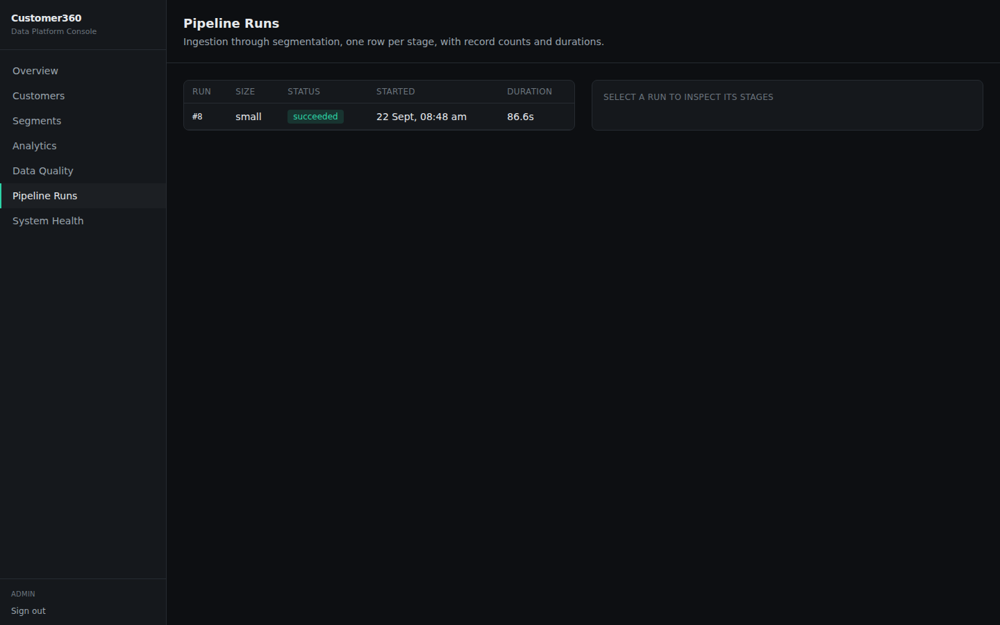

# Customer360

**Unified Customer Data & Personalization Platform** — an end-to-end
customer data engineering platform: seeded synthetic data generation,
PySpark data-quality validation, deterministic identity resolution,
distributed customer analytics, a role-secured FastAPI backend, and a
React operations console.

## Live Demo

**Frontend (public):** https://customer360-console.vercel.app/
**API (public):** https://customer360-api.vercel.app/api/v1

The console and the FastAPI backend are both live and talking to each
other. The database (Neon Postgres) is provisioned but its schema hasn't
been loaded yet, so screens that call the API currently show real error
states rather than fake data — because this project never fabricates a
response (see [Deployment status](#deployment-status) for the exact
remaining step). `docs/SETUP.md` gets the full stack running locally
against real data in a few commands.

## Architecture

```
Synthetic Data Generator (seeded, Python)
        │  9 source files, 35 declared defect types
        ▼
Ingestion → Type & Validate → Clean & Normalise  (PySpark)
        │
        ▼
Data Quality Engine  (40 rules / 6 dimensions, accept/warn/quarantine/reject)
        │
        ▼
Identity Resolution  (namespaced screening → ranked match rules →
                       iterative connected components → cluster guards →
                       stable canonical IDs + merge/split audit trail)
        │
        ▼
Customer Aggregation  (RFM, CLV, churn banding, sessionisation — PySpark)
        │
        ▼
PostgreSQL Serving Layer (34 tables)
        │
        ▼
FastAPI (JWT + Argon2id + RBAC + server-side PII masking)
        │
        ▼
React + TypeScript Console
```

Full detail: [`docs/ARCHITECTURE.md`](docs/ARCHITECTURE.md) ·
[`docs/DATA_PIPELINE.md`](docs/DATA_PIPELINE.md).

## Key Capabilities

- **Multi-source ingestion** — 9 files across 3 formats (CSV, JSON Lines,
  gzip-partitioned JSON Lines), read all-string with full lineage, then
  contract-typed via `try_cast`.
- **Configurable data quality** — 40 rules across 6 dimensions
  (completeness, validity, uniqueness, consistency, integrity,
  timeliness), compiled generically to Spark `Column` expressions; every
  record is classified accepted / warned / quarantined / rejected and
  never silently dropped.
- **Deterministic identity resolution** — namespaced identifier screening
  (static/format/frequency/name-cardinality guards), ranked match rules,
  iterative min-label-propagation connected components, post-hoc cluster
  guards (size, confidence, attribute conflict), and cross-run-stable
  canonical customer IDs with a full merge/split audit trail.
- **Customer 360 profiles** — identity + provenance, transactions, RFM/CLV,
  churn risk, segment membership, all served from real PostgreSQL data.
- **Rule-based segmentation** — a JSON rule AST compiled to parameterised
  SQL (never string-interpolated), 8 baseline segments, full-recompute
  with entered/exited delta tracking.
- **Secured API** — JWT access/refresh tokens with reuse detection,
  Argon2id password hashing, 4-role RBAC enforced server-side on every
  endpoint, server-side PII masking.
- **Operations console** — 9 screens (login, overview, customer search,
  Customer 360, segments + detail, analytics, data quality, pipeline runs,
  system health) on a cohesive enterprise design system.

## Verified Results

Every number below was reproduced live, in this repository, against a
running PostgreSQL instance, in the same session this README was last
updated — none are estimated or carried over from memory.

| Metric | Value | Evidence |
|---|---|---|
| Identity resolution — pairwise precision | **0.994** | [`benchmarks/IDENTITY_EVAL.md`](benchmarks/IDENTITY_EVAL.md) |
| Identity resolution — pairwise recall | **0.857** | same |
| Identity resolution — F1 | **0.920** | same |
| Automated tests passing | **25 / 25** | `backend/tests/` |
| Serving tables | **34** | [`docs/DATA_DICTIONARY.md`](docs/DATA_DICTIONARY.md) |
| Data-quality rules / dimensions | **40 rules / 6 dimensions** | `config/dq_rules.yaml` |
| Platform DQ score (`small` profile, seed 20260922) | **98.8 / 100** | live-verified, `/api/v1/quality/summary` |

A ground-truth construction bug found and fixed *while producing the
identity-resolution numbers* is documented honestly rather than hidden —
see ADR-15/ADR-16 in [`docs/PROJECT_DECISIONS.md`](docs/PROJECT_DECISIONS.md)
and Section X-B of the [research paper](docs/research-paper/Customer360_IEEE_Paper.pdf).

## Screenshots

| | |
|---|---|
|  Login |  Overview |
|  Customer Search |  Customer 360 |
|  Data Quality |  Segments |
|  Analytics |  Pipeline Runs |

All screenshots are of the running application against real generated
data — none are mockups.

## Technology Stack

**Data & pipeline:** Python 3.11 · NumPy (PCG64) · PySpark 3.5 · PostgreSQL
16 · Alembic · psycopg
**Backend:** FastAPI · Pydantic v2 · SQLAlchemy 2.0 · Uvicorn · PyJWT ·
Argon2 (`argon2-cffi`) · structlog
**Frontend:** React 18 · TypeScript (strict) · Vite · TanStack Query ·
React Router · Tailwind CSS · Recharts
**Infra:** Docker Compose · GitHub Actions · Vercel (frontend)

## Local Setup

```bash
make venv                 # backend/.venv with all Python dependencies
make generate SIZE=small  # synthetic data -> data/input, data/generated
make migrate              # Alembic schema -> local PostgreSQL
make run-pipeline SIZE=small
make run-api               # FastAPI on :8000 (separate shell)
cd frontend && npm install && npm run dev   # React console on :5173 (separate shell)
```

```bash
cd backend && .venv/bin/python -m c360.cli create-admin \
    --email admin@c360.local --password "<your-password>"
```

Full instructions, including Docker Compose: [`docs/SETUP.md`](docs/SETUP.md).

## Deployment status

| Component | Status |
|---|---|
| Frontend | **Live** — https://customer360-console.vercel.app/ |
| Backend (FastAPI) | **Live** — https://customer360-api.vercel.app — `/api/v1/health` returns `200`; auth/RBAC guard verified live (`401` with no token) |
| Database | **Provisioned, schema not yet loaded** — Neon Postgres (free tier), connected to both Vercel projects. Migrations + the data pipeline still need to be run once, locally, against the connection string (never shared with this session). Exact commands: [`docs/DEPLOYMENT.md`](docs/DEPLOYMENT.md) |

## Research Paper

An IEEE-style paper documenting the system's methodology and measured
results: [`docs/research-paper/Customer360_IEEE_Paper.pdf`](docs/research-paper/Customer360_IEEE_Paper.pdf)
([Markdown source](docs/research-paper/Customer360_IEEE_Paper.md), [BibTeX](docs/research-paper/references.bib)).

## Documentation

| Doc | Contents |
|---|---|
| [`docs/ARCHITECTURE.md`](docs/ARCHITECTURE.md) | Component map, layering, technology choices and why |
| [`docs/DATA_DICTIONARY.md`](docs/DATA_DICTIONARY.md) | Every serving table, column, sensitivity label |
| [`docs/API.md`](docs/API.md) | Endpoint catalogue, auth, error envelope |
| [`docs/SETUP.md`](docs/SETUP.md) | Local dev setup, all commands |
| [`docs/SECURITY.md`](docs/SECURITY.md) | Auth, RBAC matrix, masking, threat model |
| [`docs/TESTING.md`](docs/TESTING.md) | Test suites, how to run them, coverage |
| [`docs/DEPLOYMENT.md`](docs/DEPLOYMENT.md) | Public deployment status, Docker Compose, cloud-readiness mapping |
| [`docs/DATA_PIPELINE.md`](docs/DATA_PIPELINE.md) | Stage-by-stage pipeline detail, Spark mechanics |
| [`docs/PROJECT_DECISIONS.md`](docs/PROJECT_DECISIONS.md) | ADRs, scope reductions, honest gaps |
| [`docs/CHANGELOG.md`](docs/CHANGELOG.md) | What was built, in order |
| [`benchmarks/IDENTITY_EVAL.md`](benchmarks/IDENTITY_EVAL.md) | Identity resolution precision/recall |
| [`benchmarks/RESULTS.md`](benchmarks/RESULTS.md) | Measured pipeline/API timings |

## Limitations

Stated plainly rather than left implicit (full detail in
[`docs/PROJECT_DECISIONS.md`](docs/PROJECT_DECISIONS.md)):

- The PostgreSQL loader persists a working subset of what the pipeline
  computes (customers, identities, orders, customer metrics) — web
  events, sessions, tickets, marketing, quarantined-record payloads, and
  the full identity audit trail are computed correctly but not all yet
  loaded to Postgres.
- Segmentation has a SQL backend only, not the dual SQL/Spark backend
  originally scoped.
- Identity resolution's attribute-conflict guard handles the two-member
  pairwise case its worked example specifies; it does not yet generalise
  to larger mixed-edge clusters (2 of ~660 resolved pairs in the measured
  run were affected — see `benchmarks/IDENTITY_EVAL.md`).
- `medium` (50k-person) and `large` (500k-person) data profiles were not
  generated or benchmarked — all measured numbers are from the `small`
  (1,000-person) profile.
- The backend is not yet publicly deployed (see above).

Built against the full specification in
[`PROJECT_PLAN.md`](PROJECT_PLAN.md) for an Adobe Domain 3
(DB + Python + PySpark) portfolio.

## License

Original work, built for portfolio and educational purposes. No real
customer data is used anywhere in this repository (see
`docs/PROJECT_DECISIONS.md` § Originality).
